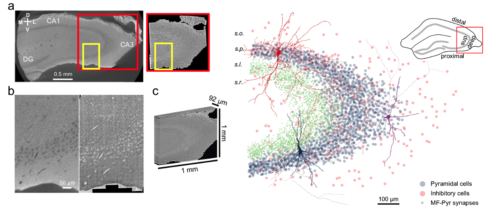
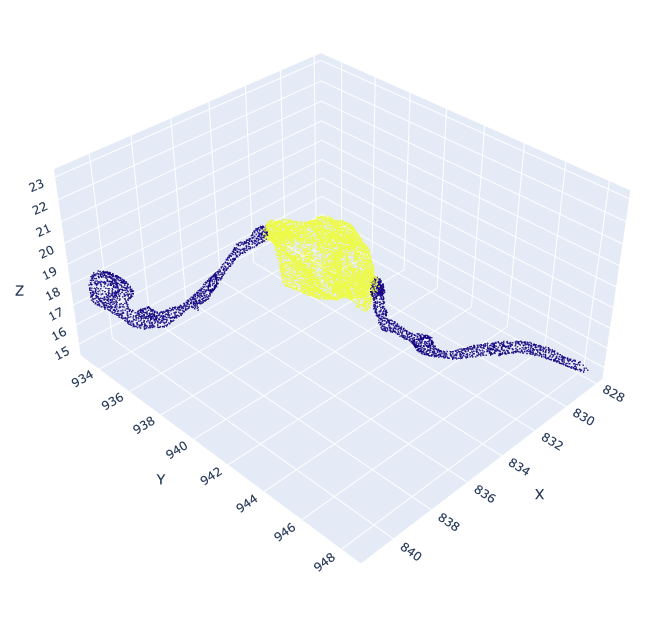

# Connectomic reconstruction from hippocampal CA3 reveals spatially graded mossy fiber inputs and selective feedforward inhibition to pyramidal cells

The repository is for the following preprint.  
(https://www.biorxiv.org/content/10.1101/2025.07.09.663979v1)

## Data availability
The EM image data and segmentation can be accessed at (https://pyr.ai)  
A list of all identified cell types can be found at (https://codex.flywire.ai/research/mouse_ca3_explorer)

## Install dependencies
The codes were written using Python version 3.10.14.  
The python module versions used for the analysis are in [requirements.txt](requirements.txt) file.  

Create a virtual environment. Then install all dependencies using:  
`pip install -r requirements.txt`   

The repository is not set up for pip installation.   

## Hardware dependencies
All notebook codes in this repo do not require GPUs. GPUs are required for vesicle segmentation, which was accomplished by using the software called [Cellpose](https://github.com/mouseland/cellpose).  
Training on one NVIDIA GTX 1050 Ti GPU took about 2 hours  

## MF bouton extraction demo
To see a demo of MF bouton extraction, run the notebook script Demo_MF_bouton_extraction.ipynb  
For bouton extraction, you need both presynaptic neuron ID (i.e. MF) and postsynaptic neuron ID (i.e. Pyr cell).   
You can change the cells by changing the values in pyr_ids and mf_ids variables.  
The bouton extraction result will be saved as an .html file:   

## License
This work is licensed under a [Creative Commons Attribution-NonCommercial 4.0 International License](https://creativecommons.org/licenses/by-nc/4.0/).

